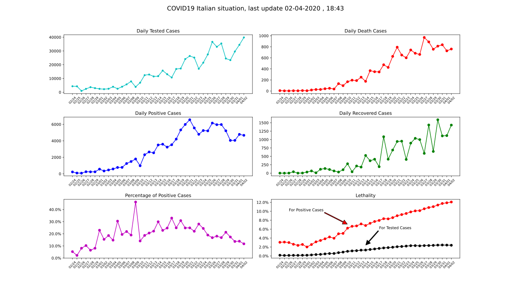

# COVID19 Italian plots

Some basic statistics on covid19 Italian data based on DPC data. I am not a data scientist by any mean am just an Electronics Engineer. I am trying to figure out the trend of the situation just to monitor it and keep my eye on it. An always updated interactive implementation can be found [here](https://el3ctrician.github.io/covid19-italian-data/)

## Web site code
the web site code is hosted under the `./docs` folder of this repo. Everything is in pure Js that runs on the client machine

 

## Latest data

## Installation

just run `pip install -r requirements.txt`from the project root and you are good to go, make sure to have python3.7 and pip installed
 
## Generate a plot

Simply run `python basic_plot.py`